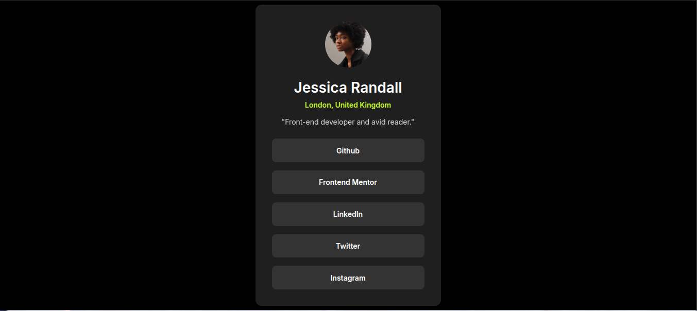

# Frontend Mentor - Social Links Profile Solution

This is my solution to the **Social Links Profile Challenge** on Frontend Mentor. The goal of this project was to build a responsive social profile card with interactive link buttons using semantic HTML and modern CSS.

Frontend Mentor challenges help developers improve their coding skills by building realistic user interfaces.

---

## 📑 Table of Contents

- [Overview](#overview)
  - [The Challenge](#the-challenge)
  - [Screenshot](#screenshot)
  - [Links](#links)

- [My Process](#my-process)
  - [Built With](#built-with)
  - [What I Learned](#what-i-learned)
  - [Continued Development](#continued-development)
  - [Useful Resources](#useful-resources)
  - [AI Collaboration](#ai-collaboration)

- [Author](#author)

---

# Overview

## The Challenge

Users should be able to:

- View the profile card on different screen sizes
- See hover and focus states for all interactive elements
- Navigate easily to different social links

This project focuses on practicing:

- Semantic HTML structure
- CSS layout and styling
- Responsive design
- Hover effects and UI interactions

---

## Screenshot

Add a screenshot of your finished project here.

```md

```

---

## Links

- Solution URL: https://www.frontendmentor.io/solutions/your-solution
- Live Site URL: https://your-live-site-url.com

---

# My Process

## Built With

- **Semantic HTML5**
- **CSS3**
- **Flexbox**
- **Google Fonts**
- **Responsive design**

Font used:

- Inter

---

## What I Learned

While building this project, I practiced several important frontend development concepts.

### Creating a Centered Layout

Flexbox was used to perfectly center the profile card on the page.

```css
body {
  display: flex;
  justify-content: center;
  align-items: center;
  min-height: 100vh;
}
```

### Building Reusable Link Components

Each social link button uses the same reusable class styling.

```css
.link {
  background-color: hsl(0, 0%, 20%);
  padding: 0.9rem;
  border-radius: 8px;
  text-align: center;
}
```

### Adding Hover Interactions

A hover effect was added to improve the user experience.

```css
.link:hover {
  background-color: hsl(75, 94%, 57%);
}
```

---

## Continued Development

In future projects I want to focus more on:

- Improving **UI component design**
- Writing **cleaner and more reusable CSS**
- Practicing **responsive layouts**
- Learning more **advanced CSS techniques**

---

## Useful Resources

- Frontend Mentor
  https://www.frontendmentor.io/

- MDN Web Docs
  https://developer.mozilla.org/

These resources helped me better understand HTML structure and CSS styling.

---

## AI Collaboration

AI tools were used during this project to assist with:

- Understanding layout techniques
- Improving CSS structure
- Generating documentation for the README

Tool used:

- ChatGPT

AI helped speed up the development process while allowing me to focus on implementing the design and learning the concepts.

---

# Author

- Frontend Mentor: https://www.frontendmentor.io/profile/StudywithMunir
- GitHub: https://github.com/StudywithMunir
